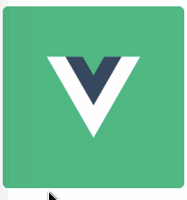

# vue-hover-mask | vue hover 遮罩组件

[](https://opensource.org/licenses/mit-license.php)
[](https://www.npmjs.com/package/vue-hover-mask)
[](https://www.npmjs.com/package/vue-hover-mask)
[](https://npmcharts.com/compare/vue-hover-mask?minimal=true)

## 介绍

当 hover 上物体时, 显示遮罩

## 效果图



## 在线示例

[https://codepen.io/dream2023/pen/oRJOGB/](https://codepen.io/dream2023/pen/oRJOGB/)

## 安装

```bash
npm install vue-hover-mask --save
```

## 使用

```js
// 全局引入
import VueHoverMask from 'vue-hover-mask'
Vue.component(VueHoverMask.name, VueHoverMask)
```

```js
// 局部引入
import VueHoverMask from 'vue-hover-mask'
export default {
  components: {
    VueHoverMask
  }
}
```

## 示例

```html
<template>
  <!-- click事件 -->
  <vue-hover-mask @click="handleClick">
    <!-- 默认插槽 -->
    
    <!-- action插槽 -->
    <template v-slot:action>
      <i class="iconfont zoom"></i>
      <i class="iconfont delete"></i>
    </template>
  </vue-hover-mask>
</template>

<script>
  export default {
    methods: {
      handleClick() {
        console.log('click')
      }
    }
  }
</script>

<style>
  @import url('//at.alicdn.com/t/font_1223885_a68qqkvtjgr.css');

  .iconfont {
    padding: 0 10px;
    font-size: 24px;
  }
</style>
```
